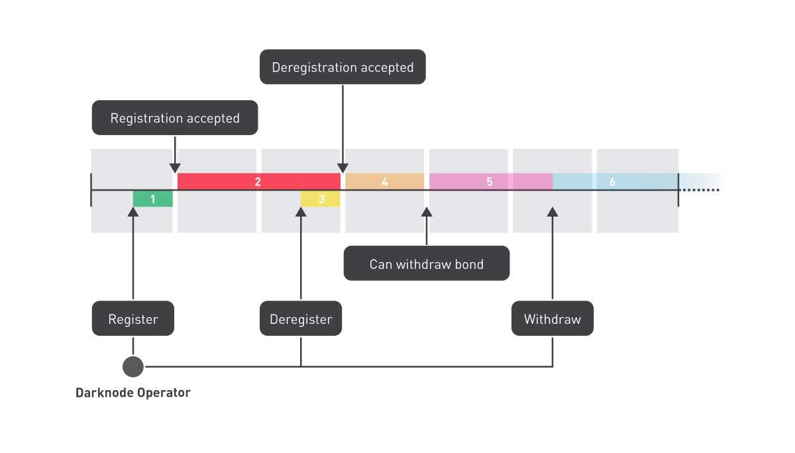

# Darknodes

## Darknode Registry

The [Darknode Registry]() is an Ethereum smart contract used to register, and deregister, Darknodes. Before a Darknode is accepted into the network by others, it must submit a bond of 100,000REN to the Darknode Registry. After deregistration, the Darknode can refund this bond.

The core purpose of the Darknode Registry is to break time down into discrete periods, called *epochs*. The registration of a Darknode is considered pending until the beginning of the next epoch. Likewise, the deregistration of an epoch is pending until the beginning of the next epoch. Once deregistration is approved, another full epoch must pass before the bond can be refunded.

**1. Register**
  The bond is sent to the Darknode Registry and the Darknode is in the *Pending Registration* state until the beginning of the next epoch. The account sending this transaction is consdered to be the Darknode operator.

**2. Registered**
  The registration is approved and the Darknode is in the *Registered* state. The Darknode is now considerd active.

**3. Deregister**
  The intent to deregister is sent to the Darknode Registry and the Darknode is in the *Pending Deregistration* state until the beginning of the next epoch. During this time, the Darknode is still considered to be active.

**4. Deregistered**
  The deregistration is approved and the Darknode is in the *Deregistered* state. It is no longer considered active.

**5. Cooling**
  The Darknode is no longer considered active. The bond cannot be refunded until the beginning of the next epoch.
  
**6. Refunded**
  The intent to refund is sent to the Darknode Registry and the bond is returned to the Darknode operator. The Darknode is removed from the Darknode Registry and can be regsitered again by any account.

## Darknode Pods

During an epoch, the number of registered Darknodes does not change — it can only change at the beginning of a new epoch. This allows Darknodes and traders to observe a static list of registered Darknodes for an epoch (whether it be the current epoch, or the previous epoch).

The static list of registered Darknodes is shuffled according to the blockhash of the epoch. This shuffling occurs off-chain using a deterministic algorithm — partitioning registered Darknodes into *pods*. Each pod has *at least* 24 Darknodes, and is responsible for processing a subset of the computations required by the [Secure Order Matcher](./03-secure-order-matcher.md).

## Syncing the Orderbook

The [Orderbook]() is an Ethereum smart contract used to store the state of orders. Before an honest Darknode admits an order into the [Secure Order Matcher](./03-secure-order-matcher.md), it will verify that the order has been signed by the required brokers and is currently in the `Open` state. The required brokers are defined by the dark pool exchange on which the order was opened.

After finding matching orders, Darknodes will change the state of the orders to `Confirmed` in the Orderbook. The Orderbook will reject the confirmation of orders that are not currently in the `Open` state — preventing the asynchronous nature of the decentralised network from resulting in conflicting order matches.

Honest Darknodes watch the Orderbook for state changes to `Open` orders.

See [Byzantine Fault Tolerance](./04-byzantine-fault-tolerance.md) for a discussion on guaranteeing that confirmed orders are matching orders.

## Syncing order fragments

Before an honest Darknode admits an order into the [Secure Order Matcher](./03-secure-order-matcher.md), it needs to receive its order fragment for that order. Order fragments store public data of an order (buy/sell, id, type, expiry, and dark pool exchange), and Shamir's secret shares of the private data (price, and volume). Merkle proofs, built from the hashes of order fragments, are signed by traders, and required brokers, and are verified by honest Darknodes.

Order fragments are required because the Shamir's secret shares are needed when running the Secure Order Matcher. They are transferred directly to the Darknodes to prevent public discovery and to reduce gas fees.

Once an honest Darknodes has synchronised an order from the [Orderbook](), and it has received the appropriate order fragment, it admits the order into the Secure Order Matcher and will begin the process of finding a match.

## Settlement

After finding matching orders, and confirming the match in the [Orderbook](), Darknodes will use the order fragments to reconstruct the private data of the orders. At this stage, everything about the matched orders is known to the Darknodes and the matched orders are submitted to the [Settlement]() layer of the appropriate dark pool exchange.

The Settlement layer is an Ethereum smart contract that exposes the ABI required by Republic Protocol. Each dark pool exchange defines *at least one* Settlement layer. A Settlement layer accepts matched orders, verifies that they are confirmed in the Orderbook, and pays a reward to the Darknodes that initiated the settlement.

The first Darknode to acquire a sufficient number of order fragments for the matched orders will receive the reward, assuming it initiates the settlement in a timely fashion. To ensure faireness, honest Darknodes follow a round-robin schedule when distributing their order fragments; forwarding to the first Darknode in the schedule, then the second, and so on. The result is that the Darknode initiating the settlement, and earning the reward, alternates each time matching orders are found.

See [Byzantine Fault Tolerance](./04-byzantine-fault-tolerance.md) for a discussion on guaranteeing settlement and fairness.

> Note: The actual exchange of cryptographic assets from one trader to another is defined by the dark pool exchange. There is no strict requirement defined by Republic Protocol, beyond the payment of fees to the Darknodes.